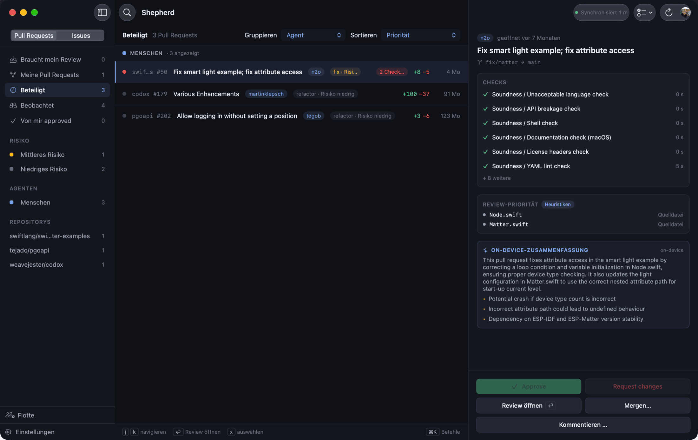
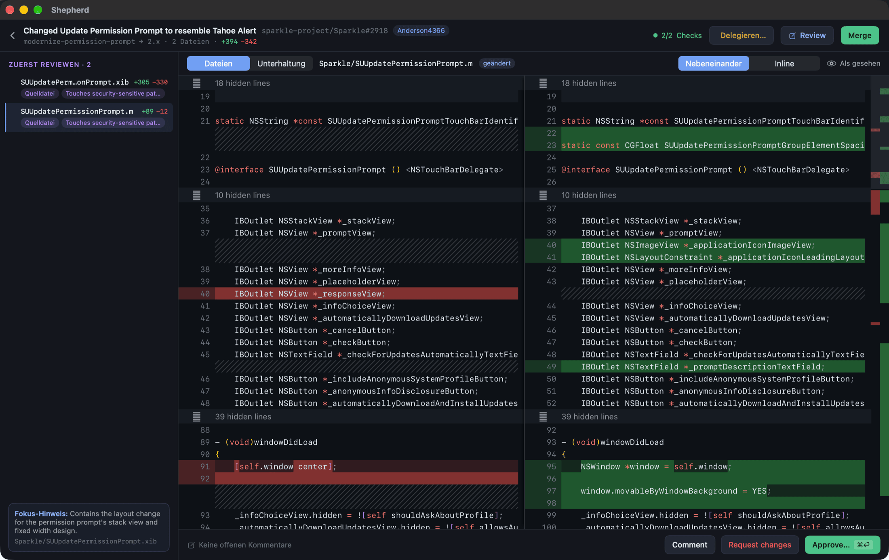
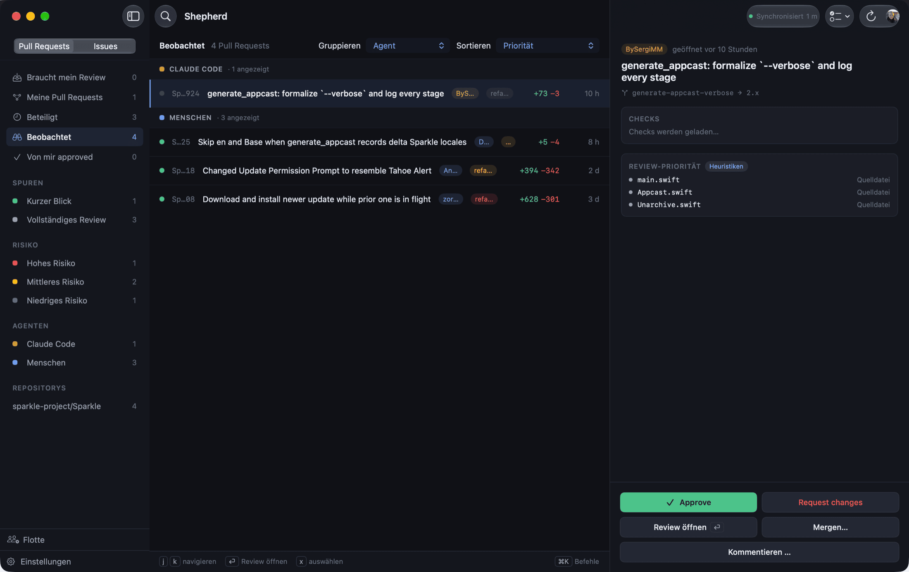
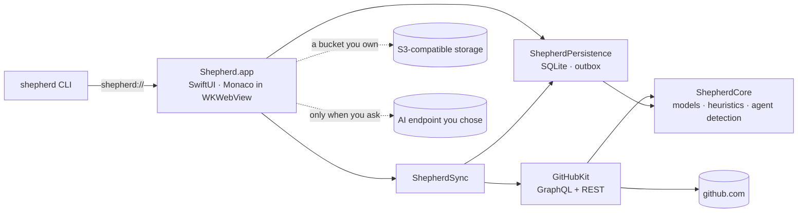

<div align="center">


# Shepherd

**A native macOS review inbox for the pull request flood.**

[](https://github.com/schnaq/shepherd/releases/latest)
[](.github/workflows/ci.yml)
[](LICENSE)
[](docs/adr/0038-macos-27-floor.md)
[](Packages/ShepherdKit/Package.swift)
[](docs/PRIVACY.md)


</div>

## Why

Coding agents open pull requests faster than any human can keep up with — across *all* of your
repositories at once, and in a study of 33,596 agent-authored pull requests, 61% carried no
recorded human review at all ([the numbers](docs/research/research-landscape.md)). Review tools
were built for a handful of pull requests a week; Shepherd is built for the flood. It herds every
pull request from every repository into one place: a fast, local-first, keyboard-driven inbox where
you triage, review and merge without opening a browser tab. It is open source, and your data stays
on your Mac.

## What it does

<table>
<tr><th colspan="2" align="left">Review</th></tr>
<tr>
<td width="50%">🔍 <b>Real diffs, in the app</b><br>Side-by-side and inline Monaco diffs — the VS Code engine — with syntax highlighting, viewed-state tracking, and files ordered by what deserves attention first.</td>
<td width="50%">💬 <b>Full GitHub review parity</b><br>Inline comments, multi-comment pending reviews, approve / request changes / comment, thread replies and resolves, checks, and merge / squash / rebase.</td>
</tr>
<tr>
<td>⌨️ <b>Focus session</b><br>⇧⌘⏎ walks you through every pull request waiting on you, one at a time, over a queue frozen at start. Twenty agent PRs, twenty keystrokes.</td>
<td>📝 <b>Saved replies &amp; templates</b><br>Reusable snippets in every comment field, plus a per-repo review checklist that prefills a new, empty review — and never touches one you started.</td>
</tr>
<tr>
<td>🧭 <b>Open in your editor</b><br>Link a repository to its local checkout and jump from a file, a finding or a CI failure straight to the line — in VS Code, IntelliJ IDEA, Cursor, the system default or a command of your own.</td>
<td>📤 <b>Nothing out of sight</b><br>A merge on its way, a queued approval or a change GitHub refused shows on the row and in the review — <i>Merging…</i>, <i>Merge queued</i>, <i>Not sent</i> — with Retry right there. <i>Merged</i> appears only once GitHub confirms it.</td>
</tr>
<tr><th colspan="2" align="left">Triage</th></tr>
<tr>
<td>✅ <b>Bulk triage</b><br>Tick the green ones, then approve or merge them behind one confirmation that lists what it will skip — red CI, conflicts, drafts, yours — and why.</td>
<td>🧾 <b>Claims beside the evidence</b><br>What the description says it did — tests added, nothing breaking, fixes #142 — next to what the diff and CI show. <i>Look closer</i> lets the on-device model point at the lines behind a claim; Shepherd finds every excerpt in the diff itself.</td>
</tr>
<tr>
<td>🏷️ <b>Where it came from</b><br>Claude Code, Copilot, Codex, Devin, Cursor or a colleague — detected on every row and usable as a lens next to repository and review state. The rail keeps its places whichever view you pick, with your watched repositories always on top.</td>
<td>📥 <b>Watch a repository</b><br>Every open pull request in a repository you watch reaches the inbox, even the ones nobody asked you to review.</td>
</tr>
<tr>
<td>☀️ <b>Morning digest</b><br>An opt-in daily summary built from the local database alone: new requests, green PRs one keystroke from done, your red CI, reviews still parked.</td>
<td>📊 <b>Menu-bar quick inbox</b><br>The number of pull requests waiting on your review, and the top ones one click away — off the same local data, so it costs no extra API call.</td>
</tr>
<tr>
<td colspan="2">📒 <b>The fleet</b><br>Every agent Shepherd has seen, and what became of its pull requests: merged, closed, reverted, rounds of changes and how often its first push was green — across every repository, then one repository at a time underneath, plus at most three sentences the counts below them support. Counts, never a score: no rank, no ordinal, no sortable rate, no traffic-light colour, and no page for a person.</td>
</tr>
<tr>
<td colspan="2">🔎 <b>Semantic ⌘K search</b><br>Type what a pull request was <i>about</i> — “flaky login test” finds “Retry the auth suite” — over titles, labels, branches, descriptions and the diffs you have opened. On-device embeddings, stored in your own SQLite, never sent to an AI endpoint; <code>owner/repo#128</code> still wins outright.</td>
</tr>
<tr><th colspan="2" align="left">Automate</th></tr>
<tr>
<td>🛠️ <b>Delegate to a local agent</b><br>Hand a PR or a single finding back to Claude Code in an isolated worktree with a budget cap and a turn cap you can lift. Optionally started for you when CI turns red.</td>
<td>🚦 <b>Auto-merge rules</b><br>Opt in, and an agent PR that is green, approved and mergeable gets its merge queued for you — narrowable by repo and label, never approving anything, every decision in a local audit log.</td>
</tr>
<tr>
<td colspan="2">💻 <b>Your own clones</b><br>Pick a folder and Shepherd reads the repository from its <code>origin</code>, links the checkout and watches every pull request in it — one step. Then <i>Start an agent…</i> hands a task you type to Claude Code on a fresh <code>agent/…</code> branch off the default branch, with the same caps. Shepherd itself pushes nothing.</td>
</tr>
<tr>
<td colspan="2">🔗 <b>Webhooks, deep links, CLI</b><br>Signed outbound events into n8n, <code>shepherd://</code> links, and a <code>shepherd</code> binary that drives the app from a terminal, Raycast or Shortcuts.</td>
</tr>
<tr>
<td>🗣️ <b>Shortcuts &amp; Siri</b><br>App Intents with typed parameters: open a pull request, show a filtered inbox, sync, start a review session, or just ask how many need you. Notifications name their pull request, so Siri can open or summarise the one it is about. No write actions — nothing can approve or merge from a phrase.</td>
<td>🔦 <b>Spotlight</b><br>Your inbox in ⌘Space: title, <code>owner/repo#123 · author · CI state</code>, labels and agent as keywords. Titles and metadata only — never a description or a diff — and one toggle removes them all.</td>
</tr>
<tr><th colspan="2" align="left">Intelligence</th></tr>
<tr>
<td>✨ <b>Drafts, not submissions</b><br>Draft a review summary or an inline comment from the diff in front of you. It lands as editable text; nothing is ever submitted for you.</td>
<td>🧠 <b>On-device first</b><br>Heuristics always, Apple Foundation Models where available, your own key optional — Claude through Apple's own model interface, any OpenAI-compatible endpoint, Konduit (EU) or Ollama.</td>
</tr>
<tr>
<td>🌐 <b>Translate in place</b><br>A description or comment in a language you don't read gets an on-device translation <i>below</i> the original — never instead of it, never through a cloud endpoint.</td>
<td>✍️ <b>Writing Tools everywhere</b><br>Apple's proofread, rewrite and tone tools in every field you write review text in — summary, inline comment, thread reply, saved reply.</td>
</tr>
<tr>
<td colspan="2">🖼️ <b>Screenshots, read on this Mac</b><br>Switch it on, and a click lets the on-device model describe up to two screenshots from a pull request's description — what changed visually, next to the text summary. Off by default; the images come from GitHub's own upload host and never reach a cloud model.</td>
</tr>
<tr><th colspan="2" align="left">Sync &amp; privacy</th></tr>
<tr>
<td>🔐 <b>Sync you host</b><br>Every setting <i>and</i> every secret in one AES-256-GCM object in an S3 bucket you own. A new Mac plus the passphrase is a set-up Mac. No account, no server.</td>
<td>🗄️ <b>Local-first by construction</b><br>SQLite is the source of truth, writes go through a persisted outbox, secrets live in the Keychain, and anonymous usage counts are off until you say yes.</td>
</tr>
<tr>
<td colspan="2">🇩🇪 <b>Auf Deutsch</b><br>Set your Mac to German and the whole app is German — the diff viewer and GitHub's error messages included; no language setting, it follows the system. GitHub's own review vocabulary stays English inside the German sentences (pull request, review, approve, request changes, merge, draft, CI), so what you read matches what the next window says.</td>
</tr>
</table>

The long form — every feature, with the decisions behind it — is in
[docs/FEATURES.md](docs/FEATURES.md).

## What it looks like



The inbox. One row per pull request across every repository, with its CI state, review state and
diff size on the row itself — grouped by repository, review state or author (person, bot, or named
coding agent), whichever lens you reach for. The right pane is the pull request without leaving
the list: its CI, the files worth opening first, and a summary written by the on-device model.



The review screen. A real Monaco diff — the VS Code engine — side by side or inline, with the
unchanged stretches folded away and changes highlighted down to the word. Comment, approve,
request changes and merge without opening a browser tab.



Watched repositories. The inbox is built from `@me` searches, which is right until a repository
matters to you without anyone naming you on it. Add it in Settings and its open pull requests
arrive too — under *Watched* until you are involved in one.

## How it stays yours

- **Local SQLite is the source of truth.** GitHub is a sync target, not a backend
  ([ADR 0006](docs/adr/0006-local-first-sqlite-grdb.md)).
- **Writes go through an outbox.** Approve offline; it lands when the network does, with retries and
  a staleness check.
- **Secrets live in the Keychain** — never in `UserDefaults`, never in the database.
- **Anonymous telemetry, off in one click.** Thirteen allow-listed events, every property an enum
  or a bucket, and never a repository, a branch or a line of code — [docs/PRIVACY.md](docs/PRIVACY.md)
  says exactly what is sent and [ADR 0036](docs/adr/0036-usage-telemetry.md) says why. The complete
  list of hosts Shepherd may contact is in
  [CONTRIBUTING.md](CONTRIBUTING.md#rules-of-the-road); adding one requires a new ADR.
- **Sync is end-to-end encrypted and self-hosted.** Your bucket, your passphrase, ciphertext on the
  wire ([ADR 0014](docs/adr/0014-encrypted-settings-sync.md)).
- **AI runs only when you ask.** Off by default, on-device where possible, and the unattended
  morning digest may never call an endpoint at all. ⌘K search is the other side of the same rule:
  it runs on every keystroke, so it is on-device *only* and has no code path to a provider
  ([ADR 0019](docs/adr/0019-semantic-search-on-device-embeddings.md)).
- **Crash reports stay on disk.** Opt-in MetricKit JSON in Application Support, no uploader in the
  code path ([ADR 0017](docs/adr/0017-local-diagnostics-metrickit.md)).

## Keyboard

| Keys | Action | | Keys | Action |
| --- | --- | --- | --- | --- |
| `j` `k` | Move down / up the list | | `r a` | Approve |
| `⏎` | Open the selected pull request | | `r x` | Request changes |
| `x` | Tick a row for bulk triage | | `r c` | Comment |
| `g a` `g r` `g s` | Group by agent / repo / review state | | `m` | Merge… |
| `⌘K` | Command palette &amp; pull-request search | | `r f` · `⇧⌘⏎` | Start a focus review session |
| `⌘R` | Sync now | | `d` `n` `esc` | In a session: done & next · next · end |
| `⌘⏎` | Submit the pending review | | | |

Two-keystroke sequences forget an unfinished prefix after 1.5 s, so a stray `r` never swallows the
next key.

## Automation & integrations

```sh
shepherd open schnaq/review#128        # …/review/128 and a github.com PR URL work too
shepherd inbox needs-my-review         # mine · involved · approved-by-me · watched
shepherd inbox --filter agent:claude-code   # humans · bots · agent:<id> · repo:<owner>/<name>
shepherd fleet                         # every agent; add an id for one agent's page
shepherd sync                          # sweep every repository now
shepherd settings automation           # jump to a Settings tab
```

Every command is a URL the app parses, so anything that can open one — Raycast, Shortcuts, a
bookmark, `open(1)`, an n8n *Execute Command* node — can drive Shepherd
([ADR 0013](docs/adr/0013-url-scheme-and-cli.md)):

| URL | Effect |
| --- | --- |
| `shepherd://pr/<owner>/<repo>/<number>` | Open that pull request's review screen |
| `shepherd://inbox` · `shepherd://inbox?filter=<token>` | Inbox, optionally filtered |
| `shepherd://fleet` · `shepherd://fleet/<agent-id>` | The fleet, optionally on one agent's page |
| `shepherd://sync` | Run one sweep now |
| `shepherd://settings` · `shepherd://settings/<tab>` | Open Settings, optionally on a tab |

**Outbound webhooks** (Settings → Automation) POST a versioned JSON event to the one URL you type —
`review.submitted`, `pr.merged`, `delegation.finished`, `inbox.new_review_request` — after the
action really reached GitHub, plus `pr.auto_merge_queued` the moment a rule decides something
unattended. With a signing secret each request carries
`X-Shepherd-Signature: sha256=<hex HMAC of the raw body>`, deliberately the same shape as GitHub's
`X-Hub-Signature-256`, so an n8n Crypto node you already have works unchanged. Schema, guarantees
and a three-minute n8n recipe: [docs/WEBHOOKS.md](docs/WEBHOOKS.md).

**AI endpoints** are yours to pick: Anthropic, or any OpenAI-compatible base URL with one-click
presets for **Konduit (EU)** and a local **Ollama**, model discovery and a connection test.

## Install

```sh
brew install --cask schnaq/tap/shepherd
```

Or download the DMG from [the latest release](https://github.com/schnaq/shepherd/releases/latest).
Every build is notarized by Apple and keeps itself current through Sparkle 2; the cask sets
`auto_updates`, so Homebrew leaves the installed copy to it. To build from source instead:

```sh
brew install xcodegen
git clone https://github.com/schnaq/shepherd.git && cd shepherd
cd web/diff-viewer && npm ci && npm run build && cd ../..   # bundle the Monaco diff viewer
xcodegen generate
open Shepherd.xcodeproj
```

Needs macOS 27 (Golden Gate) or later on Apple Silicon, Xcode 27+ and Node 22+. Sign in with GitHub via
device flow, or paste a fine-grained personal access token. A source build is unsigned and has its
updater switched off, which Settings → Account states in one line. The `ShepherdKit` package is
platform-independent — `cd Packages/ShepherdKit && swift test` needs no Xcode. The `shepherd` CLI is
its own scheme:

```sh
xcodebuild -project Shepherd.xcodeproj -scheme ShepherdCLI -configuration Release \
  -derivedDataPath .build/cli build
cp .build/cli/Build/Products/Release/shepherd /usr/local/bin/
```

## Status

**Under active development, and in daily use by the people who build it.** Releases ship signed
and notarized, update themselves through Sparkle and install through Homebrew — see
[the latest release](https://github.com/schnaq/shepherd/releases/latest). It is young software, so
expect rough edges and tell us about them. What is done, next and deliberately out of scope:
[docs/ROADMAP.md](docs/ROADMAP.md).

## Architecture

The app target owns all UI and every Apple-only framework; everything else lives in `ShepherdKit`,
an SPM package that imports no AppKit, SwiftUI or WebKit and is tested headlessly on Linux in CI.
The `shepherd` CLI links only the domain module, so it has no client, no database and no Keychain
access — it can reach the app solely through `shepherd://`.



Details in [docs/ARCHITECTURE.md](docs/ARCHITECTURE.md); every significant decision has an ADR in
[docs/adr](docs/adr/README.md), grounded in the research reports in [docs/research](docs/research).

## Contributing

[CONTRIBUTING.md](CONTRIBUTING.md) has the setup, the module rules and the hard privacy lines
(allow-listed anonymous telemetry, Keychain-only secrets, local-first), and
[docs/PRIVACY.md](docs/PRIVACY.md) is the plain-language version for people who are not reading the
source. Third-party licences that ship inside the app are in [NOTICES.md](NOTICES.md).

## License

[MIT](LICENSE) — 🐑
